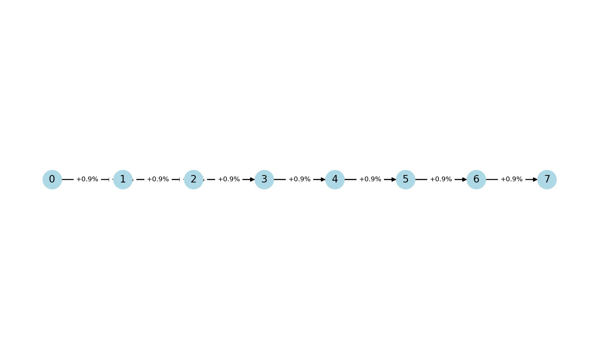
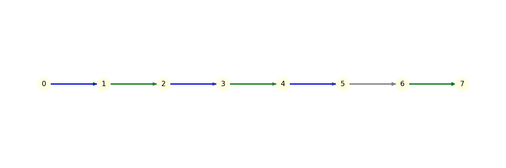

# Financial Mathematics Project – Investment Optimization

This repository contains the implementation of an algorithm to optimize investment policies over a time horizon, based on a mathematical model described in the project PDF.

## Project Overview

### Problem Description

An investor has the opportunity to invest an initial capital over a time horizon denoted as `T = [0, n]`. There are:

- **m investment products** `Pk` (`1 ≤ k ≤ m`), each characterized by:
  - **Start date** `dk`
  - **End date** `fk`
  - **Interest rate** `τk`

Additionally, a **base interest rate** `τ0` applies to each basic period `[t, t+1]` where `0 ≤ t ≤ n-1`.

### Objective

Determine the best investment strategy (sequence of placements) over the period `T` to maximize the final capital.

### Mathematical Formulation

This problem is modeled using a **directed graph** `D = (V, A)`, where:

- `V` is the set of vertices representing each time point: `{0, 1, 2, ..., n}`
- `A` is the set of arcs:
  - For each `t` from `0` to `n-1`, an arc `(t, t+1)` with coefficient `c(t, t+1) = 1 + τ0`
  - For each investment `Pk`, an arc `(dk, fk)` with coefficient `c(dk, fk) = 1 + τk`

### Solution Approach

- A **path** from `0` to `n` in this graph represents an investment strategy.
- The total capital multiplier `C(P)` of a path `P` is the product of coefficients of all arcs in the path:

  ```
  C(P) = Π c(a) for all arcs a in P
  ```
- The goal is to find the path `P*` such that `C(P*)` is maximized.

### Why Brute Force Enumeration is Inefficient

If the graph contains all possible arcs `(t', t)` where `0 ≤ t' < t ≤ n`, the number of paths from `0` to `n` increases exponentially with `n`. Enumerating every possible path becomes computationally infeasible for large `n`. This is why a dynamic programming approach is preferred.

### Recursive Relation for Optimal Coefficient

For each time `t`, the optimal coefficient can be computed using:

```
Coef(t) = max [ Coef(t-1) * (1 + τ0),  max_{k ∈ N⁻(t)} (Coef(dk) * (1 + τk)) ]
```

Where `N⁻(t)` is the set of investment products `k` that end at time `t`.

### Example

Consider `n = 7`, `τ0 = 0.009` (0.9%) per period. There are 5 available investment products:

| Product k | Start Date (dk) | End Date (fk) | Interest Rate τk (%) |
|----------|----------------|--------------|----------------------|
| 1        | 0              | 2            | 1.9                  |
| 2        | 1              | 3            | 2.0                  |
| 3        | 2              | 5            | 3.0                  |
| 4        | 3              | 6            | 3.0                  |
| 5        | 4              | 7            | 2.8                  |

Paths such as `(0,1),(1,2),(2,5),(5,6),(6,7)` correspond to specific investment sequences, and their cumulative coefficient is computed by multiplying the associated rates.

#### Example Graph

Below is a visualization of the graph D used in the example:



Vertices represent each date from 0 to 7. Arcs are drawn for both base rate connections `(t, t+1)` and special investment opportunities `(dk, fk)`.

#### Enumerated Paths

All possible paths from `0` to `7` are enumerated to explore the different sequences. Here is a visual representation:



Highlighted paths represent sequences yielding higher returns, demonstrating the effect of choosing optimal investment arcs.

## Project Structure

- `data/` - Folder to store investment data files.
- `main.py` - Main Python script implementing the algorithm.
- `utils.py` - Contains:
  - **`lecture_donnees()`**: Reads investment data from the file.
  - **`optimiz_coef()`**: Computes optimal coefficients for each time step.
- `README.md` - English project description.

## Requirements

- Python 3.x
- NumPy (optional, for efficiency)

## How to Run

1. Place your investment data file (formatted as: `dk fk τk` per line) in the `data/` folder.
2. Run:

```bash
python main.py
```

## Output

- The best investment strategy (sequence of arcs).
- The maximum final capital achievable.

## Algorithms

### Data Reading

**`lecture_donnees()`** function reads:
- `n` (time horizon)
- Base rate `τ0`
- List of investment options `(dk, fk, τk)`

### Optimization

**`optimiz_coef()`** computes for each `t`:
- The maximum coefficient achievable to date `t` by comparing:
  - Basic period extension: `Coef(t-1) * (1 + τ0)`
  - Any special investment ending at `t`: `Coef(dk) * (1 + τk)`

### Main Process

1. Initialization of `Coef(0) = 1`.
2. Sequential computation of `Coef(t)` for `1 ≤ t ≤ n`.
3. Output of optimal path and final coefficient.

---

**Optional Extension:**
VBA/Excel versions can also be implemented following similar logic. 

---

## Clarifications and Study Notes

- **"T = [0, n]" explanation:** 
   The time interval covering the start and end points of the system.

- **Investment product characterization:**
  - `m` investment options → There are m investment options (total number of investments).
  
- **Each product properties:**
  - `dk`: start date, `fk`: end date, `τk`: interest rate.
  -  This investment is only valid in the interval [dk, fk].

- **Objective reminder:**
  - Find the best investment policy.

- **Graph Model Reminder:**
  -  Graph is directed, nodes represent dates, arcs represent investments or period interests.

- **Formulation:**
  -  Cumulative product: multiplication of all arc coefficients.

- **Enumeration observation:**
  Number of all paths grows exponentially, inefficient.

- **Key strategy:**
   Optimal policy should be computed using path-finding algorithm.

These notes serve as useful reminders or clarifications tied to the mathematical and algorithmic structure of the project.
